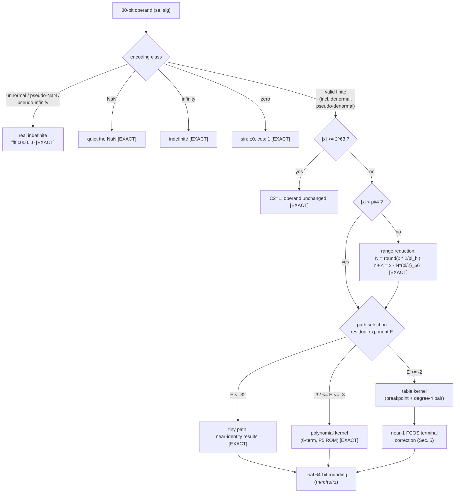
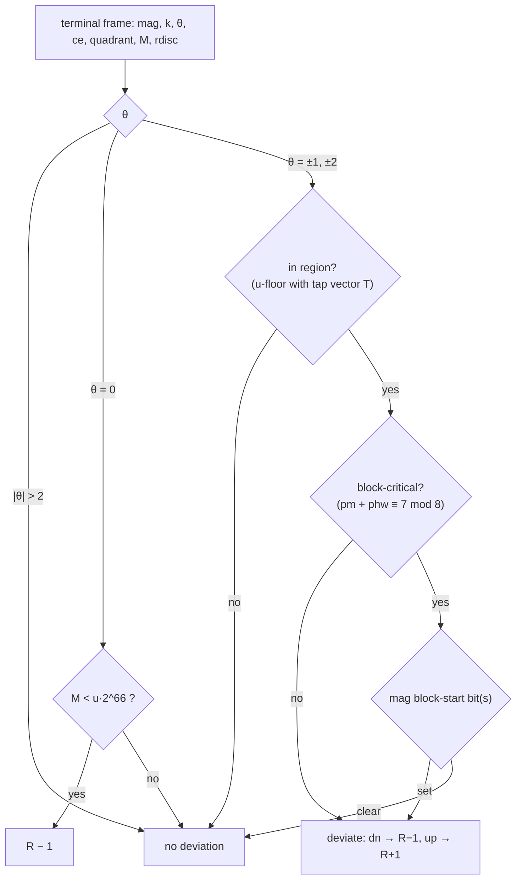

# The Skylake x87 transcendental algorithm — as reconstructed

## Current paired algorithm — H1717, 2026-09-05

All three instructions now use validated general numerical paths by default.
The standalone program below is unchanged. FSINCOS computes a distinct paired
polynomial once, not two standalone polynomials. For residual magnitude r:

```text
S = CHOP67(r*r)
p = sine_K6; q = cosine_K6
for i = 5,4,3,2,1:
    p = RN64(CHOP67(p*S) + sine_Ki)  # exact sum after the CHOP67 product
    q = RN64(CHOP67(q*S) + cosine_Ki)
sine prevalue   = r + CHOP67(RN64(p*S)*r)
cosine prevalue = 1 + CHOP67(q*S)
```

Exact M66 reduction and quadrant/residual signs select and sign each prevalue
before final RC64. The external cosine lane supplies C1. Table, tiny, encoding
and range rules are shared with the established program. Every Horner product
is truncated to 67 bits before its coefficient addition. The rule is
unconditional, with no fitted operand selector, coefficient or final patch.

The promoted program matches 23,838,534 retained paired lane appearances and
all 13,800 frozen fresh H1712 tuples (27,456 outputs, 13,728 C1). The predecessor
fails 750 fresh rows. All standalone regressions and the 81-row frontier stay
exact. The H1713 last-product-only graph is falsified by FSINCOS RN
`3ffc e79000000c3e46e7`: it returns sine `...d857`, while hardware and this
all-product graph return `...d858`. The first stored difference is at sine K2;
the final prevalues are -5/1024 and +5/512 ulp relative to the RN midpoint.
H1717 additionally passes 45,517,233 i7 paired rows and all saved H1712/
H1714/H1715/review captures, with no recapture. See
`h1717-policy2-promotion.md` for evidence and limits. Physical fusion is not
identified and finite validation is not an all-input silicon theorem.

## Current standalone algorithm — H1708, 2026-09-05

This section supersedes the standalone R96/terminal-selector description in
the historical material below. The main C now defaults to the validated
H1630/H1633/H1638 graph, with R84 off and fitted/history corrections bypassed.
The paired FSINCOS path was unchanged by H1708; H1717 above supersedes H1713's schedule.

For normalized magnitude truncation T, define
`M(x,y)=T67(T67(x)*T64(y))`, `A(x,y)=RN64(x+y)` and
`MR(x,y)=RN64(T67(x)*T64(y))`. MR rounds the exact port product once.

With polynomial residual magnitude r and the selected native K1..K6:

```text
S=M(r,r); F=M(S,S)
N=A(K1,M(F,A(K3,M(F,K5))))
P=A(K2,M(F,A(K4,M(F,K6))))
L=M(S,N); R=M(F,P)
sine prevalue:   r+M(r,A(L,R))
cosine prevalue: 1+T67(L+R)
```

Apply the quadrant/residual result sign before final architectural RC64.
Every input-port cut is an identity except T64(S) in the fourth-power
producer. This is a numerical representation, not physical-wiring proof.

The exact table cells select b=18/22/26/30/36/44/52. Set a=r-b/64,
S=M(a,a), and let p,q be the native four-coefficient sine/cosine Horner
programs using M and A. Compute `v=A(a,M(M(S,p),a))`, `w=MR(S,q)`;
sine prevalue is `tsin+T67(M(tcos,v)+M(tsin,w))`, cosine prevalue is
`tcos+T67(-M(tsin,v)+M(tcos,w))`. Native ROM/coefficient corrections are
unchanged. Table input-port cuts are identities under this ordering.

For non-bypass r<2^-32, RN/away-directed rounding takes leading r or 1,
C1=1; toward-zero takes its 64-bit predecessor, C1=0. The direct external
exponent<-68 bypass is distinct: sine returns the input value, cosine +1,
C1=0 in every mode. Specials are handled before normal finite arithmetic.

Reduction uses M66=0x3243f6a8885a308d3, A=s*2^(e+2), q=nearest(A/M66),
D=A-q*M66 and exact signed residual D*2^-65. The external sign/quadrant
route is retained. No quotient or rounding-history tag feeds the fixed graph.

All 81 incumbent-frontier outputs, 3,379,017 retained output appearances and
3,378,987 C1 checks pass the promoted build; 7,056 opened boundary/center
outputs also pass. No known standalone numerical miss remains. See
`h1707-h1708-standalone-promotion.md` for scope, hashes, independent/domain
evidence and prior fresh challenges. This does not claim a new replay of the
historical 182,737,480-result suite or independent FSINCOS validation.

## Historical algorithm description — standalone corrections superseded above

**What this file is.** The maintained plain-language description of
what the chip does, stage by stage, as far as we know it — with the
evidence class for each claim and an explicit register of blind
spots.  The bit-exact reference is `src/fsincos_skylake.c` (the
master algorithm, all validated rounds inlined). The
[processor comparison](skylake-comparison.md) records the experiments
supporting the arithmetic explanations below.

Evidence classes used below:
- **[EXACT]** bit-exact on every obtainable corpus, blind-validated.
- **[EXACT-fringe]** bit-exact except enumerated residual rows
  (each named in the blind-spot register).
- **[BEHAVIORAL]** reproduces hardware bit-for-bit but the internal
  arrangement is our construction, not a claim about the silicon.
- **[MECHANISM]** structural interpretation consistent with the
  data; not directly observable.

## 0. Lineage

The Skylake implementation is a descendant of the **Pentium (P5)
table-assisted design**, not the "table-free" 2000-Itanium-paper
algorithm: its polynomial coefficients and table entries match the
physically-decoded P5 constant ROM (`p5_rom_constants.h`), evaluated
through a chopped-67-bit multiply datapath.  The 2000-paper spec is
kept for contrast at the end of `algorithm-spec.md`.  [BEHAVIORAL,
constants EXACT]

## 1. Top-level dataflow



Quadrant bookkeeping: N mod 4 selects the sine/cosine swap and the
result signs; FCOS runs the same machinery with the phase
incremented by one quadrant.  [EXACT]

## 2. Encoding classes and specials

- Unnormals (nonzero exponent, explicit-integer bit 0), pseudo-NaNs
  and pseudo-infinities take the masked-#IA response: both results
  are the real indefinite `ffff:c000000000000000`, every rounding
  mode.  Pseudo-denormals (exponent 0, integer bit 1) are *valid*
  and compute normally.  [EXACT — Round 63; blind 1,408/1,408]
- NaN operands are quieted and passed through; infinities produce
  the indefinite; zeros are exact (sin ±0 → ±0, cos → 1).  [EXACT]
- `|x| >= 2^63`: C2 set, operand unchanged.  The edge is exact at
  the 2^63 encoding boundary (dense sweep both sides).  [EXACT]

## 3. Range reduction

For `|x| >= pi/4`: `N = round(|x| * 2/pi)` using the 128-bit 2/π
approximation `A2F9836E4E441529 FC2757D1F534DDC0`; the residual is
computed **exactly** as `r + c = x − N·(π/2)` against the 66-bit π
constant `3.243F6A8885A308D3₁₆` (the classic limited-precision x87
π — the documented "FSIN is inaccurate near multiples of π"
property is this constant, preserved deliberately).  [EXACT over
all corpora; see blind spot B6 for the untested extreme tail]

## 4. Kernels

**Path select** on the residual's normalized exponent E:
tiny (E < −32), polynomial (−32 ≤ E ≤ −3), table (E ≥ −2, i.e.
r ≥ 0.25).  All thresholds behave as exact binary comparisons.
[EXACT]

**Table kernel.**  The breakpoint index is an **exact bit-slice of
the residual's top 3 significand bits** (Rounds 62/66):

```
  r in [1/4, 1/2):  lanes 1/16 wide,  b = 18 + 4*lane   (b/64 = 18..30/64)
  r in [1/2, pi/4]: lanes 1/8  wide,  b = 36 + 8*lane   (b/64 = 36..52/64, top lane clamped)
```

`a = r − b/64` (signed), then a degree-4 sine/cosine polynomial
pair in `a²` (P5 ROM constants) combines with the table's
`sin(b/64), cos(b/64)` pair through chopped 67-bit multiplies and
the angle-addition identity.  A 53-bit (double) intermediate here —
the pre-Round-62 scaffolding — misclassifies the top ~2^-55 sliver
below each interior lane boundary; hardware is exact.  This holds
identically for the trig table path and FPTAN's.  [EXACT — blind
0/7,936 (trig) and 0/2,944 (FPTAN) vs incumbent 1,954 resp. 1,420]

**Polynomial kernel.**  Six-term odd/even pair from the same ROM,
Horner in r², chopped-67 multiplies with rn-64 coefficient adds.
The sine branch's fourth power runs one squarer input port
truncated 67→64 bits: `fourth = chop67(sq·(sq & ~7))` — Round 86;
recovered as the exact mechanism of the last-bit "+1 family"
(234/234 on fires) and established as the *unconditional* datapath
by suite-wide + fresh-blind scoring (fixes every sine-family
deviation including the hostile corpus's; zero collateral across
183M suite + 16M blind rows).  [EXACT]

**FPTAN** computes the same sine/cosine quotient pair and one final
divide; **F2XM1** is a separate polynomial engine.  Both are exact
against 2^30-scale exhaustive binary64 sweeps and the x87-native
probe sets.  [EXACT]

## 5. The near-1 FCOS terminal correction

The deepest reconstructed structure.  When the cosine result sits
in the near-1 band, the terminal add/subtract that assembles it
resolves a retained-vs-borrowed last unit with dedicated logic; its
deviations from naive chopping are what Rounds 52–65 reconstruct.
FSIN's odd-quadrant internal cosine shares this producer.  [EXACT-
fringe]

### 5.1 Frame quantities (behavioral names)

With `sq = chop67(m·m)`, `f4 = chop67(sq·sq)`, chain outputs
`left = chop67(sq·neg)`, `right = chop67(f4·pos)`:

```
  terminal subtract:  mag = S − B          (S = left-side sum + payload,
                                            B = right side, common scale)
  k = width(mag) − 67;  R = mag >> k       (retained 67-bit result)
  disc = mag mod 2^k                       (the discard)
  θ    = disc          if disc <= 2        ("down side")
       = disc − 2^k    if disc >= 2^k − 2  ("up side"; |θ| <= 2)
  ce   = rscale + k    ∈ {−72, −73, −74};  phase  phw = ce mod 8 ∈ {7, 0, 6}
  s4   = width(sq²) − 67 ∈ {66, 67};  t4 = sq² mod 2^s4
  L    = sq mod 8 (low Booth digit);  sqlow = sq − 2^66
  M    = L·sqlow − t4                      (generate-column margin:
                                            Booth PP0 vs the discard)
  rdisc = (f4·pos) mod 2^sR                (right product's discard)
  side  = [m >= B504F333F9DE6800₁₆]        (the 1/√2 pivot)
  quadrant = (s4, side)
```

### 5.2 The comparator taps  [EXACT-fringe — Round 64]

Two tap bits classify `rdisc` against thirds of its binade — but
the hardware comparator is **not** exact thirds.  It reads the
Booth 3× hard multiple summed with both addend columns below bit 47
killed:

```
  comp = 3·rdisc − (2·rdisc mod 2^47) − (rdisc mod 2^47)
  b1 = [comp >= 2^sR]        b2 = [comp >= 2^(sR+1)]
```

Every single-constant form (exact thirds, ceil at any width,
exact+2^-t) is refuted by cross-quadrant brackets; the truncated
form explains all θ=0/down votes but ~2 known rows, and a proven
non-monotone pair shows a deeper-bit input decides at the fringe
(blind spot B1).  [MECHANISM: a truncated hard-multiple adder in
the multiplier's carry-predict path]

### 5.3 The u-floor  [EXACT]

One functional form, four quadrant tuples
(a, G1, G2, p, Q, K, par; W(d), d = |e2(left)−e2(right)|):

```
  u = K·⌊(a·L + G1·b1 + G2·b2 + p·(L mod 2) + W(d) ∓ T) / Q⌋ + par·(L mod 2)

  (66,hi): 2,2,1, 0, 4,1,0;  W = −5(d−7)
  (66,lo): 4,1,0, 0, 2,1,0;  W = −9 −5(d−9)
  (67,lo): 4,2,1,−2, 4,2,1;  W = −5(d−7)
  (67,hi): 2,2,3,−3, 8,2,1;  W = −4 −2(d−7)
```

### 5.4 Tie gate and θ bands  [EXACT-fringe]

- **θ = 0 (tie gate):** T = 0; **fire ⇔ M < u·2^66**; a fire drops
  one retained unit (R−1).
- **θ ∈ {±1, ±2} (bands):** T is a small per-(direction, |θ|,
  quadrant) integer tap vector (16 vectors; (66,hi) and (67,lo)
  share all of them).  Region: down ⇔ M < u·2^66 (T subtracted),
  up ⇔ M ≥ u·2^66 (T added).  Inside the region every row deviates
  (down → R−1, up → R+1) **except at block-critical cells**.
- **The binade-top corner cell (67,1, d=8, sR=64)** [EXACT —
  Round 67]: populated only by operands within 2^46 of the binade
  top (x → 0.25⁻; empty in every other sampled window — all other
  (67,1,d=8) rows are sR=63).  There M is degenerate (M//2^66
  pinned to {L−2, L−1}) and the gate reads the digit ladder
  `D = L + b1 + b2 − [3·rdisc < 2^47]` on the thirds lattice
  instead of any M-comparison (the last term is the Round-68
  zero-lane drop: lane −1 when the 3× sum has no bit above the
  kill line; the 2^47 offset matches the lane-1/2 comparator
  offsets — one geometry at all three lanes): **θ=0 fire ⇔ D ≥ 3;
  down |θ|=1 region ⇔ D ≥ 6; down |θ|=2 region ⇔ D ≥ 9
  (block-start law verbatim inside); the up lane never fires.**
  Blind: comb17, 2/2,936,595 vs incumbent 428,322 (Round 67);
  comb18, 2/5,100,243 vs 3, the decisive row a dn1 zone row
  confirming the lane drop on an untested direction (Round 68).

### 5.5 The block-start law  [EXACT]

The deviation machinery behaves as an **8-bit carry-select adder
confirming a mispredicted carry/borrow against the next block**:

```
        bit:   k                      k+8        bs
  mag:  ......|<-- propagate run pm -->|..........|■...
               run of ~(S xor B) up from k         first 8-aligned
                                                   block start >= k+8
  bs = k + 8 + ((8 − phw) mod 8)

  critical  ⇔  (pm + phw) ≡ 7 (mod 8),  at the phase's landing pm
               (pm ∈ {7,8} for phw ∈ {7,0};  pm = 9 for phw = 6)

  at critical cells:   up:   fire ⇔ mag bit(bs)
                       down: fire ⇔ mag bit(k+8) AND bit(bs)
                       (phw = 6: both directions read bit(bs) alone)
```

Validated end-to-end at all three ce bands; the ce = −74 band
(phase 6, W1 low operand edge) was found by the comb13 fresh
lattice and closed blind 0/94,647 (Round 65).  [MECHANISM: radix-8
Booth partial products, 4:2 CSA tree, carry prediction over
unsummed low columns, 8-bit carry-select reconstruction — the
Pentium-lineage FPU structural prior]

### 5.6 Diagram — terminal correction decision flow



## 6. Paired FSINCOS

The paired instruction shares the table datapath bit-exactly with
the standalone instructions.  Its cosine-lane near-boundary
deviations at the same operands are deterministic on hardware but
**provably not a function of any operand bit field** (purity
failure + steering demonstration, h662y/h663c): the coin
decorrelates smoothly with input distance at every scale.  The
deliverable there is a characterized statistical model (stratum
base × criticality × the lud2 left-truncation ladder), NOT part of
the bit-exact C model.  This is a permanent, *proven* blind spot of
value-frame modeling (B4), read as schedule/datapath state.

## 6.9 The captured-exception ledger (Round 84)  [CAPTURED]

A fifth evidence class exists as of 2026-08-22: **[CAPTURED]** —
banked hardware behavior shipped as data, not derived.  The 43
residual suite rows (43 unique keys over 40 distinct operands —
54 keys before Round 86's sine-chain law derived and DELETED the
11 sine-family keys, hostv1's convergent included: the hostile
corpus is now reproduced by pure derived law; every remaining
family enumerated in B1-B3/B9/B10 below) are proven — five independent closure programs
at 10^2..10^4-row power (value frames, stage signatures, exact
tails, operand-space geometry, retained-discard exact matching;
experiments h883-h902) — to be gated by inputs outside every frame the
model computes.  **The 2026-08-19 "epoch/machine-state" reading of
this is RETRACTED: the deviations are bit-stable across five days
(0/48M changed rows, hardware-vs-hardware) and bit-identical on a
second physical machine (54/54 ledger keys) — deterministic,
portable, underived ALGORITHM, not state.**  The sine-chain value
mechanism f4' = chop67(sq·(sq&~7)) is exact on all fires
(234/234); its activation predicate is the open derivation target
(leading candidate: always-on within the reduced route, with
"fires" = rows where the f4-vs-f4' difference is architecturally
visible).  The cos-terminal strata (the R72/R82/R83/A1 mined-table
dissolutions) remain underived last-bit laws.  Round 84
ships their banked labels as `r84_ledger[]` in the C model: exact
(instruction, rounding-mode, 80-bit-operand) keys applied at the
architectural output layer of the standalone FSIN/FCOS entry
points only.  Zero collateral holds **by construction** (the
overlay cannot fire off-list; flag-off is byte-identical — GATE4),
the R83 survival criterion is satisfied on the full sensitive
space (= the 50 keys, each individually hardware-verified), and
the banked suite carries **no key conflict** across its 150M rows
(verified at extraction). These lookup entries record unexplained
results rather than a derived arithmetic rule. Provenance:
`experiments/r84_misses.tsv` + `r85_rz_misses.tsv` (corpus, index,
operand, hw, pre-R84 model for all 57 rows).  ROUND 85 (2026-08-23)
extended the suite to the RZ rounding mode on every corpus, both
hosts (45.7M fresh captures, ledger-key epoch probe 50/50 before
and after each batch): 5 deviations, ZERO new operands — every RZ
miss is a known machine-state operand behaving mode-consistently
(RZ==RD on positive results byte-identical, e.g. the comb15 fb90
singleton; RZ==RU on the negative-result sine rows).  The model's
RZ rounding logic is validated clean across the extension.

**2026-09-02 current-source update:** the paragraph above is the historical
R84/R85 state, not the current ledger size.  Replaying its 33 surviving
entries against the promoted ledger-disabled R1378 composition proves 24
now derived; they have been deleted.  `r84_ledger[]` contains nine keys over
eight operands.  The complete current ledger-disabled suite has 11 misses:
those nine keys plus two modes of one d0d0 operand that were never added to
the table.  The historical FSIN c003 key is now reproduced without the
ledger.  R1378 is confined to the negative cosine Horner arm and is not
credited for that sine result.

## 7. Blind-spot register

| # | Item | Status / evidence | Ranked next step |
|---|------|-------------------|------------------|
| B1 | Comparator fringe (b26/d800/d0d0/ba10 class + 3 fresh comb15/17 lane-boundary rows: f010 at lane 2 +1.1e-5, f410 at lane 1 +1.2e-5, the lane-0 row was RESOLVED by Round 68's zero-lane drop and leaves this set) | In the sliver (E = 3r − j·2^sR < 2^47) the shipped trunc-47 form is EXACTLY vote = 1 − carry(killed columns); the fringe rows are where the chip's carry-PREDICT disagrees with true carry (h671); c̄ is non-monotone in the killed field's top bits even within one cell | ONE unified band (h688 localization theorem): all 19 exact-thirds violations across 4,392 votes — including every near-lane up-side row formerly classed point-family — lie at E ∈ (0, 2.41·2^47), within +18.4e-6 of a lane in a ±1000e-6 window (p~1e-33). The open object: a per-row threshold K ∈ (0, ~2.4·2^47] above exact thirds; K is NOT any tested killed-column decomposition (h678-h687 elimination: {2r,r} by theorem, per-PP kills, pair reads over the schedule space, early reads, per-stage cuts — invariant b260-vs-d800 tension). Remaining space: an untested array decomposition, or non-value state (h488 class, bare-metal instruments). Do not re-run eliminated families; do not exclude near-lane up rows from vote mining. **UPDATE — band-density attack h702-h708 (comb19, 4,924→9,883 votes), 2026-08-17: RESOLVED to a comparator form.** K *is* the killed mass after all — the h678-h687 eliminations tested only the ABSOLUTE-47 column; the true kill column is RELATIVE (2^(sR−16)) and SIDE-dependent (side 0 one bit shallower), and the double-lane tie (θ=0, low3=1) takes the carry (single-truncation). rdisc's low bits = the square's low bits, which is why K looked like an sq&63 table. Shipped as **Round 69** (`g_round69_relmask_sidedep`, default ON; build -DG_ROUND69=0 to A/B): i7 regression net −2 (comb9 12→11, comb13 8→7, both blind), zero regressions; Skylake-VM FSIN unaffected. Residual ~1.9% (104/5349 rd votes) = ~75% tie-rounding (last-bit of an internal quantity, near-boundary) + ~0.5% structural θ=0 carry tail; recoverable in principle from behavioral data but requires an exact bit-level model of every intermediate rounding (die imaging shortcuts it, is NOT required — FCOS is a deterministic input→output map). Next: only worth pursuing if bit-exact closure is an explicit goal |
| B2 | Isolated point-fire family — RE-SCOPED by h688: near-lane up rows (ba10/d920/de40/e5c0/e090/e740) move to B1's comparator band; true members are the far-from-lane rows (corner dn early-fires ffffc00024077827 D=4 / ffffc0006e4548d9 D=5 / fffff00047c167a3 D=8, fffc00000bd0e8f0, f310; ~8 rows / 49M+) | Out-of-region fires, (67,1)-concentrated; value-frame laws (trailing zeros, R-edge) refuted; clean censuses everywhere else | Keep the isolation ledger; re-census on every new corpus |
| B3 | θ=0 singletons e22 / be6 / cca + comb16's ffffff80075216a0 (R−2 deep-fire at corner D=6, 1/829,033) + fb90 tie retraction | Anomalous fires/retractions at exact structural magnitudes | Same as B2 |
| B4 | Paired sc-lane residual coin | PROVEN schedule state, not a value function (h663c) | None (re-litigating a proof); statistical model stands |
| B5 | Band-map completeness | ce=−74 (Round 65) and the binade-top corner cell (Round 67) were each invisible until a fresh lattice entered new operand territory; the A8/F0/W2-upper/binade-top edges are now swept ([0xF0,0x100) tiled, comb15-17) | Remaining unsampled: interior 2^54 lattice-point lower edges, non-3ffc exponent windows (scanner is 3ffc-locked) |
| B6 | Reduction extreme tail | Reduction validated over all corpora + near-k·π/2 probes, but no exhaustive sweep of worst-case cancellation operands at large exponents | Targeted worst-case-cancellation operand generation (continued-fraction convergents of 2/π) |
| B7 | Silicon mechanism | All [MECHANISM] readings (Booth/CSA/carry-select) are inference from behavior | Heritage silicon capture when hardware appears |
| B8 | Status-word micro-semantics | Results and C1/C2 validated; PE/IE and flag sequencing not systematically swept | Extend the specials harness to status-word comparison |
| B9 | θ-band/tie retained-lsb residual — the DOMINANT class (R69 census: 29 operands = 12 band + 7 tie + 6 q67th2 never-fire + 5 corner, minus overlaps; h714-h717 2026-08-18) | 28/29 rows are EXACTLY the model ±1 retained lsb (2^(rscale+k)); three rows pinned exact by grid-point brackets (hw_rd==hw_ru); fb90 alone needs +2..4. The 2026-08-17 "odd/even poly rounding boundary" localization is REFUTED (perturbation target-size artifact — coarse nudges land anywhere in 128-256-RU output cells; h716 matrix). Wrap-adjacency unifies the families: every θ-band/tie row sits ≤2 low units from the k-field wrap, so a few-unit S−B/payload difference is output-identical to a gate fire-flip; umag e-sweep viable 25/29, sign locked to θ side (empties = be6/ef6/5216a0/fb90 singletons). Gate margins: tie rows razor-edge (\|margin\| ≤ 0.36 units ⇒ sub-unit threshold term, h656 second-order candidate); 9/9 missed band fires obey h662k crit/bs in a WIDER region; 3 over-fires show the boundary moves both ways per cell; q67th2 not explained by sibling tap vectors; corner fires just below the D-thresholds | T6 contrast mining (--dump-internals over all wrap-adjacent rows, clean vs miss, discriminant on the payload/lane micro-rules and alignment fields); T7 re-aimed density scan (u-floor-edge/tie-razor/q67th2/corner pre-filters, sub-unit threshold resolution, blind-lock the wider-region-h662k prediction). **UPDATE 2026-08-18 pm (h718-h724):** determinism of all 29 rows PROVEN (100× recapture, 3 modes, byte-equal to banked); five hypothesis families eliminated at scale against a 132k clean-row dump (exact-fused products, cut-column truncation ± bias, naive h662k region widening — 75.7% counterexample rate, margin-as-concentrator, cell-matched feature contrast — all base-rate). Residual is a real value law below statistical reach at n=5-12/family. Paths: clean-wall tap fitting (A), vote densification ~10/campaign (B), representation hunt (C), documented floor (D) |
| B10 | Large-\|x\| reduced-route ±1-ulp tail — NEW (randv1 blind corpus, 2026-08-18): 17/21 miss operands, exponents 2^4..2^60, reduced \|r\|<0.25 routing through the post-reduction standalone-direct kernels (the path no comb corpus exercises — B5's non-3ffc blind spot materialized) | All ±1 ulp, single-mode; 13/21 reconciled all-modes by ±1..2 lsb of the wide reduced argument rw (--perturb=red:d); 8 finer. Mechanism space: reduction low bits vs direct-kernel rounding fringe — undetermined (red-fit is necessary-not-sufficient, h718 lesson). Density ~2.5e-6 among large-\|x\| operands | DENSIFY (cheap: plain large-exponent random captures, ~250 votes/100M rows), then the h714/h715-style forensics per row; this family is NOT at a wall — it is fresh territory. **UPDATE 2026-08-20 (h780-h798 census): B10 DECOMPOSED.** The deployment-density residual (randv1 21 + rv2 22 fresh-blind rows, all DI-classified) = **14 sine-branch (i1=0) MODEL-OVER operands** (2 poly-frame ties broken opposite + 12 corr/final-add-stage rows, tz-heavy, directed-mode doubles — the sine lane's own terminal-correction borrow candidates) + **11 act0 default-terminal rows** (6 neg=1 carries, all sf8≤low3; 5 neg=0 borrows) + **9 act1 default carries** + **4 r59-path act1 rows**. The act0-default carry/borrow conditioner beyond (act, neg, low3, sf8) is below the terminal value frame (R72 staircase candidate blind-rejected ck14/ck15; h798 bit microscope at noise ceiling); same h486-class profile as the sine-branch gate. Sine-branch +1 family: gate × magnitude decomposition established (fire ⇒ sq&7≠0, monotone frontier ~1.3·(sq&7) even-lsbs, m=0 tie negatives pin extra≡0; visibility-controlled at scale; N-frame re-killed at power; F-anomaly RETRACTED same session: the family's output signature is hw=mo−1 [negative poly], so the 14 'model-over' ops ARE +1-family fires at deployment density — the largest goal family; gate×magnitude structure stands under corrected labels, h799/h800) |

## 8. Validation scoreboard (2026-08-23, through Round 85)

**The full suite is at ZERO under all four rounding modes.**  The
bare `gcc -O2` build of `src/fsincos_skylake.c` (ledger default-ON)
matches every banked capture row on both hosts (rn/rd/ru/rz; the rz
captures landed 2026-08-23, epoch-probed 50/50 both sides):

```
  FCOS   comb7  0 / 7,791,928      comb9   0 / 26,465,332
         comb11 0 / 4,027,500      comb12  0 / 4,065,592
         comb13 0 / 30,501,128     comb14  0 / 126,196
         comb15 0 / 11,617,196     comb16  0 / 5,379,884
         comb17 0 / 3,915,460      comb18  0 / 6,800,324
  FSIN   h347 / sweep / dense / h405win / h409sep (VM, x4 modes):
         0 / 2,020,348
  randv1 (blind 8M random ops, FCOS+FSIN x rn/rd/ru/rz):
         0 / 64,000,000
  hostv1 (2M hostile: all pi/2 convergents+semiconvergents to 2^62,
         k*pi/2 ±4ulp, boundary hostiles; FCOS+FSIN x rn/rd/ru/rz):
         0 / 16,026,592
  SUITE TOTAL: 0 / 182,737,480
  FPTAN  2^30 exhaustive binary64 (3.2e9 obs): 0;  probe sets: 0
  F2XM1  2^24+ exhaustive: 0
```

Of these, 43 rows (43 keys) are carried by the captured-exception
ledger (Sec. 6.9), NOT by derived law (57/54 before the Round-86
sine-chain law) — the derived-model distance
is enumerated row-by-row in B1-B3/B9/B10 and in
`experiments/r84_misses.tsv` + `r85_rz_misses.tsv`; pre-R84
three-mode distances were comb 30, randv1 18, hostv1 4.  rv2 (the 2026-08-20 fresh blind, 22 distinct
ops / 48M, same families, banked on the i7) is NOT ledger-covered
and remains the honest deployment-density estimate of the open
mechanism classes (~5e-7).  Re-verify with
`experiments/r84_suite_zero.sh` (the full i7 suite, streaming,
asserts zero), `experiments/r58_vm.sh` (FSIN, Skylake VM),
`src/sibling_exhaustive` (FPTAN/F2XM1), `src/fsin_exhaustive`
(FSIN binary64 space).
